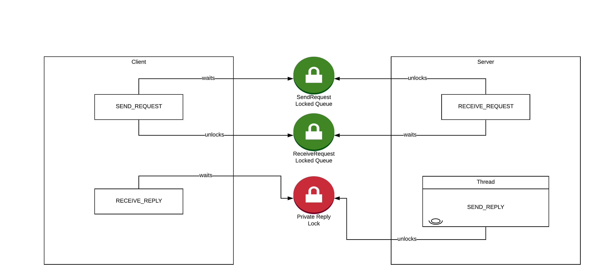

# Computer Access to Bathrooms

- **Short Description**: Client-server application capable of handling conflict situations when accessing shared zones
- **Environment**: Linux
- **Tools Used**: C
- **Institution**: [FEUP](https://sigarra.up.pt/feup/en/web_page.Inicial)
- **Course**: [MIEIC](https://sigarra.up.pt/feup/en/cur_geral.cur_view?pv_curso_id=742&pv_ano_lectivo=2019)
- **Curricular Unit**: [SOPE](https://sigarra.up.pt/feup/en/ucurr_geral.ficha_uc_view?pv_ocorrencia_id=436440) (Operating Systems)

## Group Members
- Diogo Samuel Fernandes (up201806250@fe.up.pt)
- Hugo Guimarães (up201806490@fe.up.pt)
- Telmo Baptista (up201806554@fe.up.pt)

## Program usage

### Compile
The compiling part can be done by running the command `make` to compile both server and client, if it is intended to compile only one side of the program then specific rules can be used to do so, as shown below

Compile everything
```sh
make
```
or
```sh
make all
```

Compile server side only
```sh
make server
```

Compiler client side only
```sh
make client
```

Compile shared libraries
```sh
make shared
```

### Cleanup
```sh
make clean
```

### Run
The executable files are `./bin/` directory after you run the command `make` in terminal.

To run the server, you must specify the time the server will be executing in the flag `-t` and the name of the public channel from which the server will accept requests
```sh
./bin/Qn <-t nsecs> [-l nplaces] [-n nthreads] fifoname
```
or can be run via the symbolic link created by `make`
```sh
./Qn <-t nsecs> [-l nplaces] [-n nthreads] fifoname
```


To run a client server, you must specify the time the client will be executing in the flag `-t` and the name of the public channel of the server to which the client will send requests
```sh
./bin/Un <-t nsecs> fifoname
```
or can be run via the symbolic link created by `make`
```sh
./Un <-t nsecs> fifoname
```

## Description


## Synchronization mechanisms


