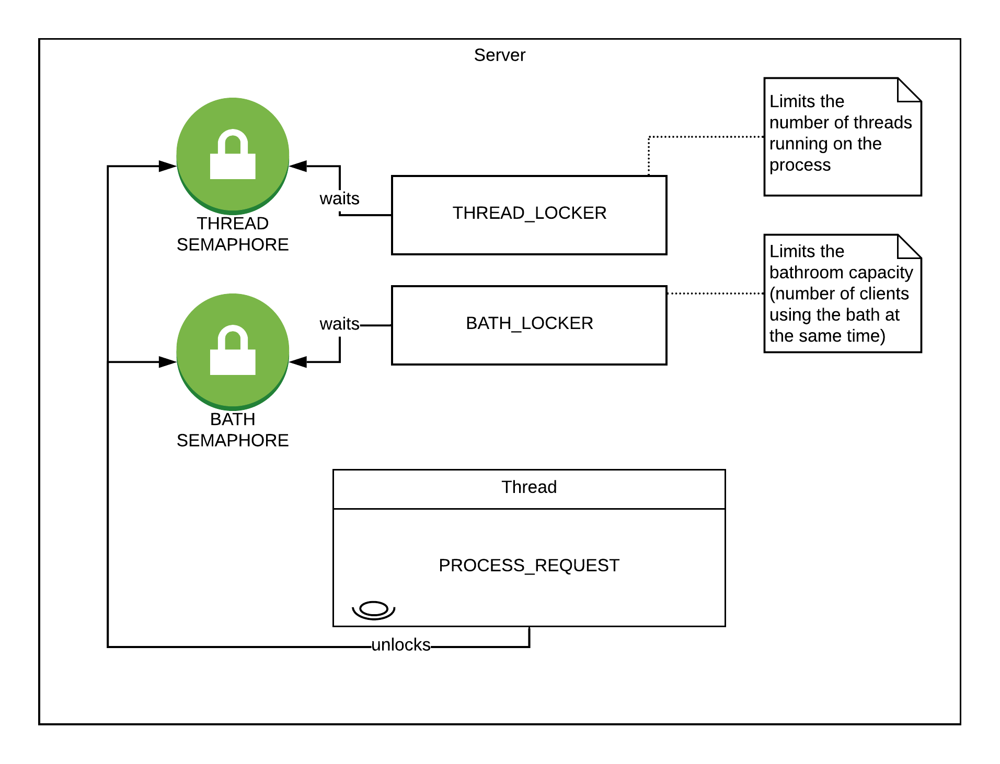

# Computer Access to Bathrooms

- **Short Description**: Client-server application capable of handling conflict situations when accessing shared zones
- **Environment**: Linux
- **Tools Used**: C
- **Institution**: [FEUP](https://sigarra.up.pt/feup/en/web_page.Inicial)
- **Course**: [MIEIC](https://sigarra.up.pt/feup/en/cur_geral.cur_view?pv_curso_id=742&pv_ano_lectivo=2019)
- **Curricular Unit**: [SOPE](https://sigarra.up.pt/feup/en/ucurr_geral.ficha_uc_view?pv_ocorrencia_id=436440) (Operating Systems)

## Group Members
- Diogo Samuel Fernandes (up201806250@fe.up.pt)
- Hugo Guimarães (up201806490@fe.up.pt)
- Telmo Baptista (up201806554@fe.up.pt)

## Program usage

### Compile
The compiling part can be done by running the command `make` to compile both server and client, if it is intended to compile only one side of the program then specific rules can be used to do so, as shown below

Compile everything
```sh
make
```
or
```sh
make all
```

Compile server side only
```sh
make server
```

Compiler client side only
```sh
make client
```

Compile shared libraries
```sh
make shared
```

### Cleanup
```sh
make clean
```

### Run
The executable files are `./bin/` directory after you run the command `make` in terminal.

To run the server, you must specify the time the server will be executing in the flag `-t` and the name of the public channel from which the server will accept requests, can additionally specify the maximum number of threads and the capacity of the bathroom
```sh
./bin/Q1 <-t nsecs> [-l nplaces] [-n nthreads] fifoname
```
or can be run via the symbolic link created by `make`
```sh
./Q1 <-t nsecs> [-l nplaces] [-n nthreads] fifoname
```

To run the client, you must specify the time the client will be executing in the flag `-t` and the name of the public channel of the server to which the client will send requests
```sh
./bin/U1 <-t nsecs> fifoname
```
or can be run via the symbolic link created by `make`
```sh
./U1 <-t nsecs> fifoname
```

## Description
The aim of the project was to develop a client-server application capable of dealing with conflict situations when accessing shared areas.  
The shared area is a bathroom with several unisex seats, controlled by a ***Q*** process (server) to which requests for user access are addressed.  
Access requests are sent through a ***U*** multithreaded process (client), and the time required by the interested party to be in a place of the sanitary facilities is indicated by it. Orders will stay in a service queue until they have a turn, and at such time, the respective user accesses a place on the premises during the requested time, under the control of the ***Q*** server, then the resource is released to another user.

### Flag Description
In the server program ***Q***:
- `-t nsecs` - approximate number of seconds that the program should work
- `-l nplaces` - bathroom capacity
- `-n nthreads` – maximum number of thread to fulfil requests
- `fifoname` – name of the public channel (***FIFO***) to be created by the server to fulfil requests

In the client program ***U***:
- `-t nsecs` - approximate number of seconds that the program should work
- `fifoname` – public channel name (***FIFO***) for communication with the server

## Synchronization mechanisms

To solve synchronization issues we opted to use one public semaphores (represented above by the colour green) and one private per request (represented above by the colour red), as show in the image below



As the *FIFO*'s are opened with the flag `O_NONBLOCK` active, the `read` call returns immediately whether the *FIFO* has data or not (non blocking call) even if there is a process or thread with the *FIFO* open for writing. As for the `write` call, it will return error if there's no process or thread with the *FIFO* open for reading.

Thus, we only need to synchronize the reading from *FIFO*, resulting on the scheme above.

The public semaphore guarantees there is data in the *FIFO* before the server reads it, getting unlocked (using `sem_post`) by the client after writing the request, while the server waits for the semaphore to be unlocked (using `sem_wait`).
On the other hand, the private semaphore is used to guarantee the client has data in the reply *FIFO* before reading it, the process is similar to the public semaphore, as the client waits for the semaphore to be unlocked by the server (the server unlocks it after trying to write the reply).

### Parsing
To parse the arguments passed via the command line, it was created two parsing methods, one for the [client](./client/src/parse.c), the other for the [server](./server/src/parse.c), as they receive different arguments.

The structure of the parsing system is similar in both cases, returning a bit mask to identify which flags were present on the arguments, and additional information, such as the path, is returned in the argument by using a structure to store the additional information needed such as the *FIFO* name, and in the server side, the *maximum number of threads* and the *bathroom capacity*.

## Alarms
To determine how long each process will be running we set up one alarm in client and server.
The process will then receive a signal `SIGALRM` when the elapsed time has equal to the time passed as argument.
In the signal handler function, the one variable will be set to have the value 0, so the main loop will stop and the program will end.

In order to stop the client from requesting after the server closes, it is sent by the first thread that identifies the public request FIFO as closed a `SIGALRM` signal to the main thread via `pthread_kill`, and the it is called `alarm(0)` to deactivate any active alarms on the process.

## Protocol
The requests and the replies have the same format, thus, it was created a single structure to handle both of them, [`request_t`](./shared/include/protocol.h).  
The structure holds information of
```c
struct request {
    int         id;     // Request / Reply ID
    pid_t       pid;    // ID of the process
    pthread_t   tid;    // ID of the thread
    int         dur;    // duration of the bathroom usage
    int         pl;     // number of order given by the server
};
```
To fill the structure, the protocol provides three functions, one to fill the request, and two to fill replies

Request fill, used by the client process
```c
int fill_request(request_t *request, int id, pid_t pid, pthread_t tid);

Request - structure to be filled
ID      - Request ID (decided by the client)
PID     - Process ID (obtained via getpid())
TID     - Thread  ID (obtained via pthread_self())
DUR     - Duration is filled with a random value between 10ms and 1s
PL      - There is no order number assigned, it is filled with -1
```

Reply fill, used by the server if it accepts the request
```c
int fill_reply(request_t *reply, int id, pid_t pid, pthread_t tid, int dur, int pl);

Reply   - structure to be filled
ID      - Reply ID (decided by the server)
PID     - Process ID (obtained via getpid())
TID     - Thread  ID (obtained via pthread_self())
DUR     - Duration is the same as the request received
PL      - Order number assigned by the server
```

Reply fill, used by the server if it rejects the request
```c
int fill_reply_error(request_t *reply, int id, pid_t pid, pthread_t tid);

Reply   - structure to be filled
ID      - Reply ID (decided by the server)
PID     - Process ID (obtained via getpid())
TID     - Thread  ID (obtained via pthread_self())
DUR     - It is filled with -1
PL      - It is filled with -1
```
